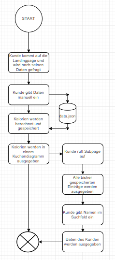
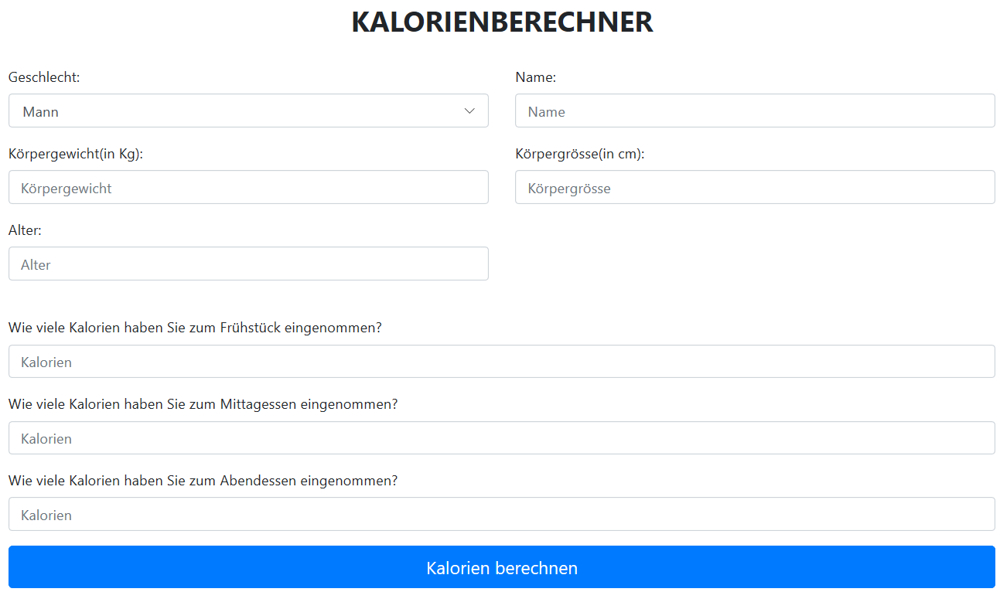
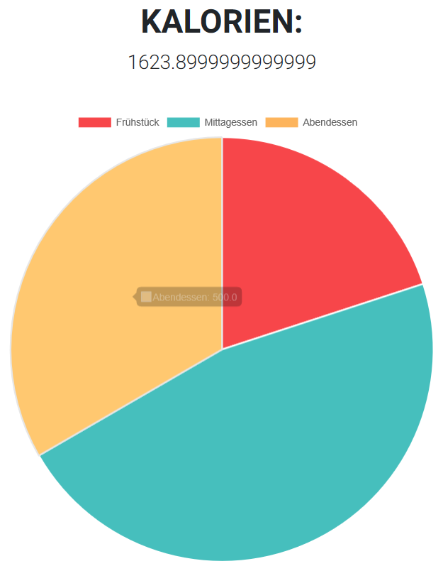

# Kalorien Berechner
Die Fitnessindustrie boomt. Als Folge davon beschäftigen sich immer mehr Menschen mit Ernährung. Verschiedenartige Diäten werden ausprobiert, um die körperlichen Ziele zu erreichen, die sich viele Personen setzen. Was bei Diäten immer eine wichtige Rolle spielt, sind die Kalorien, die täglich eingenommen werden dürfen. Hier schafft der Kalorienberechner Abhilfe, indem es durch eine eingebaute Formel automatisch Kalorien berechnen kann.

## Funktion
Das Tool soll in der Lage sein Daten abzufragen und anhand dieser Daten den täglichen Kalorienbedarf der jeweiligen Person zu berechnen. Gleichzeitig soll eine Datenbank erstellt werden, in der die Daten von allen früheren und dem aktuellen User gespeichert werden. Somit kann der User seine eigenen Daten nochmals abrufen und mit den Daten von anderen Personen vergleichen, die das Tool vor ihm benutzt haben. 

## Installation
Folgende Pakete müssen installiert sein, um den Kalorienberechner starten zu können:
- Flask
- Jinja2
- Python 3.6
- Pandas
- flask sqlalchemy

Das Tool kann danach über die app.py mit folgendem Befehl ausgeführt werden:
python app.py

## Flussdiagramm
In diesem Flussdiagramm wird der Arbeitsablauf des Tools dargestellt.

## Benutzeranleitung

1. Als erstes muss das Tool gestartet werden. Anschliessend kommt der Kunde auf die Landingpage, auf der er seine persönlichen Daten eingeben kann. Wichtig für die Kalorienberechnung sind Geschlecht, Körpergewicht, Körpergrösse und Aktivität. Zudem können Kunden eigeben wieviele Kalorien sie zum Frühstück, Mittagessen und Abendessen gegessen haben.

2. Anschliessend wird dem Kunden die tägliche Kalorienmege ausgegeben, bei der der Kunde nicht zu und nicht abnimmt. Diese Information ist sehr wichtig für jede Diät. Gleichzeitig werden dem Kunden die bereits verzehrte Kalorienmenge für Frühstück, Mittagessen und Abendessen in einem Kuchendiagramm ausgegeben.

3. Nun kann der Kunde noch auf einer Subpage eine Liste mit den Daten von früheren Nutzern finden. Diese Liste ist auf der records datei und kann in der Suchleiste eingegeben werden. Mithilfe einer eingebauten Suchfunktion kann der Kunde seine eigenen und die Daten anderer Suchen. Die Suchfunktion basiert auf Namen.

